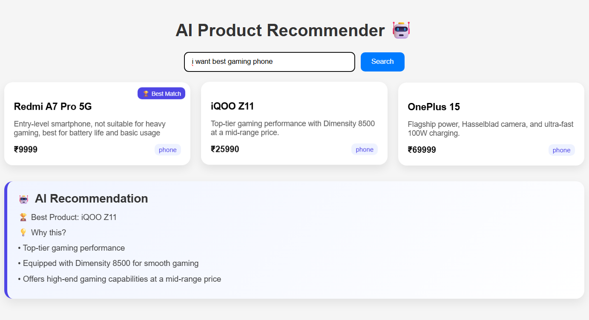
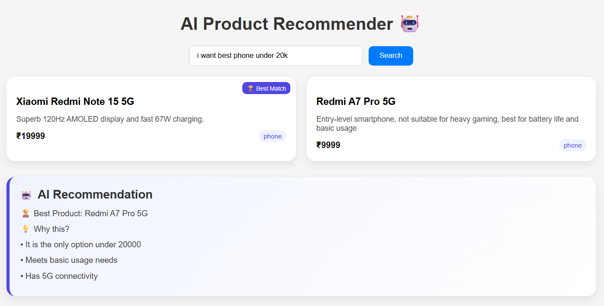
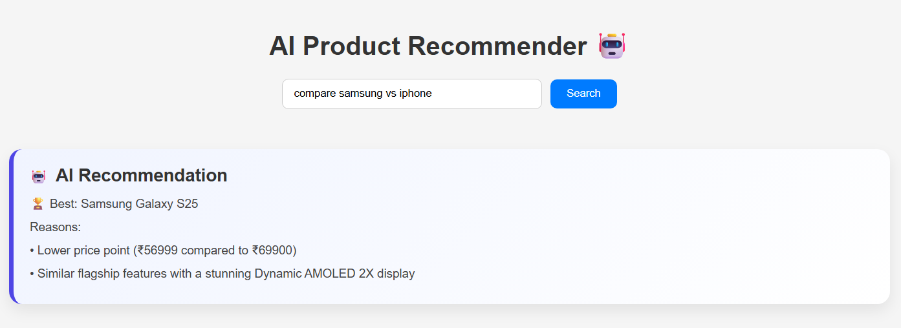

# 🤖 AI Product Recommendation System

An AI-powered product recommendation system that suggests the best products based on user queries using **RAG (Retrieval-Augmented Generation)**, **Vector Search**, and **LLM reasoning**.

---

## 🚀 Features

* 🔍 Smart product search using natural language
* 🧠 AI-based recommendations using LLM (Groq - LLaMA 3)
* ⚡ Semantic search with embeddings (Sentence Transformers)
* 📊 Vector database powered by Qdrant
* 🔄 MongoDB integration for product storage
* ⚖️ Product comparison (e.g., *iPhone vs OnePlus*)
* 💰 Price-based filtering (e.g., *under 20k*)
* 🎯 Context-aware recommendations (no hallucinations)

---

## 🏗️ Tech Stack

### Frontend

* React.js
* CSS

### Backend

* FastAPI
* Python

### AI / ML

* Sentence Transformers (`all-MiniLM-L6-v2`)
* Groq API (LLaMA 3.3 70B)

### Database

* MongoDB (Product storage)
* Qdrant (Vector search)

---

## 🧠 How It Works

1. User enters a query (e.g., *"best gaming phone under 20k"*)
2. Query is converted into embeddings
3. Qdrant retrieves the most relevant products
4. Filter applied (category, price)
5. LLM analyzes results and selects the best product
6. UI displays:

   * Recommended products
   * Best product
   * Reasoning

---

## 📸 Screenshots





---

## ⚙️ Installation & Setup

### 1️⃣ Clone the repository

```bash
git clone https://github.com/your-username/ai-product-recommender.git
cd ai-product-recommender
```

---

### 2️⃣ Backend Setup

```bash
cd server
python -m venv venv
venv\Scripts\activate   # Windows
pip install -r requirements.txt
```

---

### 3️⃣ Environment Variables

Create `.env` file:

```env
GROQ_API_KEY=your_api_key_here
```

---

### 4️⃣ Run MongoDB

Make sure MongoDB is running locally:

```bash
mongodb://localhost:27017/
```

---

### 5️⃣ Insert Products

```bash
python mongo_setup.py
```

---

### 6️⃣ Sync with Qdrant

```bash
python sync_qdrant.py
```

---

### 7️⃣ Start Backend

```bash
uvicorn api:app --reload
```

---

### 8️⃣ Frontend Setup

```bash
cd ai-recommender
npm install
npm start
```

---

## 🧪 Example Queries

* best gaming phone
* best phone under 20k
* best laptop for students
* compare iPhone vs OnePlus

---

## 📂 Project Structure

```
ai-product-recommender/
│
├── ai-recommender/       # React frontend
├── server/               # FastAPI backend
│   ├── agent.py
│   ├── api.py
│   ├── mongo_setup.py
│   ├── sync_qdrant.py
│
├── qdrant_data/
├── requirements.txt
└── README.md
```

---

## 🎯 Key Highlights

* Combines **RAG + LLM + Vector DB**
* Handles **real-world queries**
* Prevents hallucination using **strict context control**
* Built as a **full-stack AI application**

---

## 🚀 Future Improvements

* Add user authentication
* Deploy online (Render / Vercel)
* Add product images
* Improve UI/UX

---

## 👨‍💻 Author

**Abhilash Addagatla**
B.Tech CSE (AI & ML)

---

## ⭐ If you like this project

Give it a ⭐ on GitHub!
